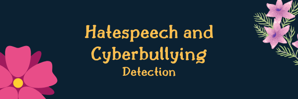
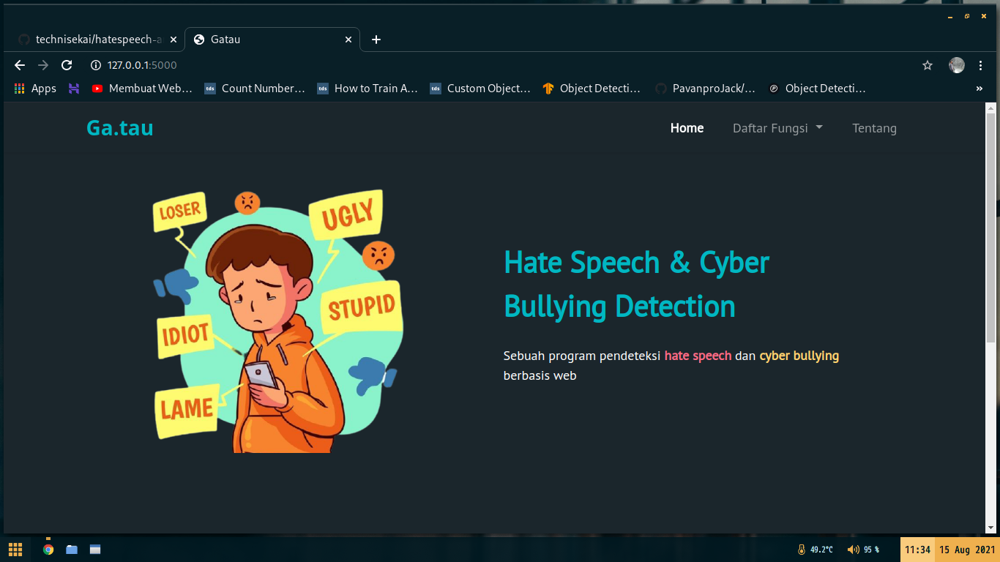
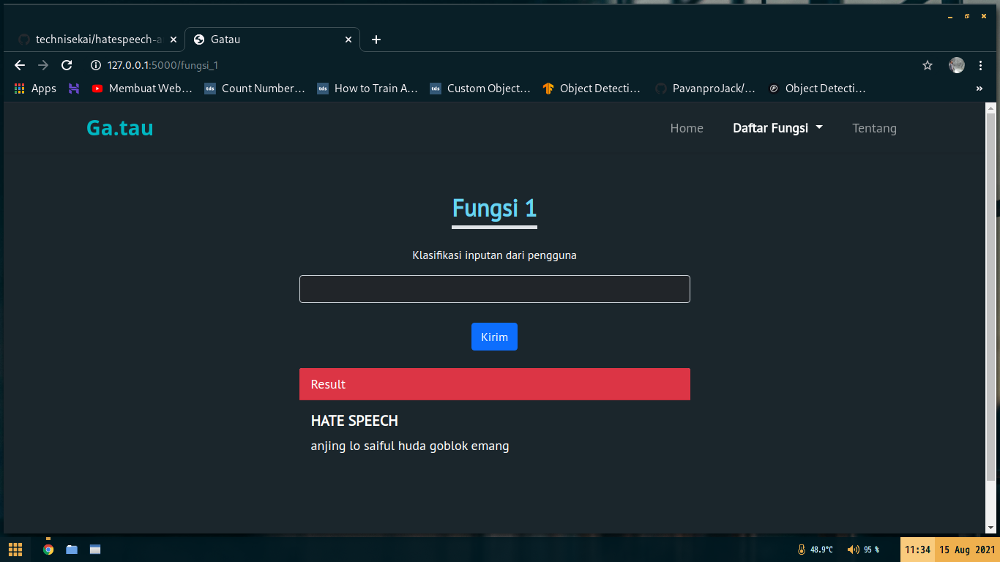
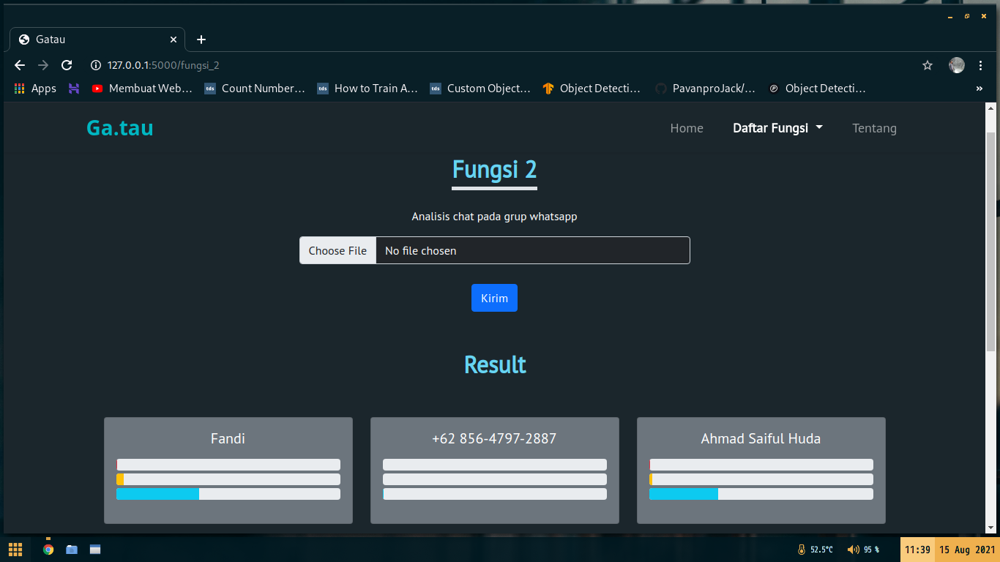
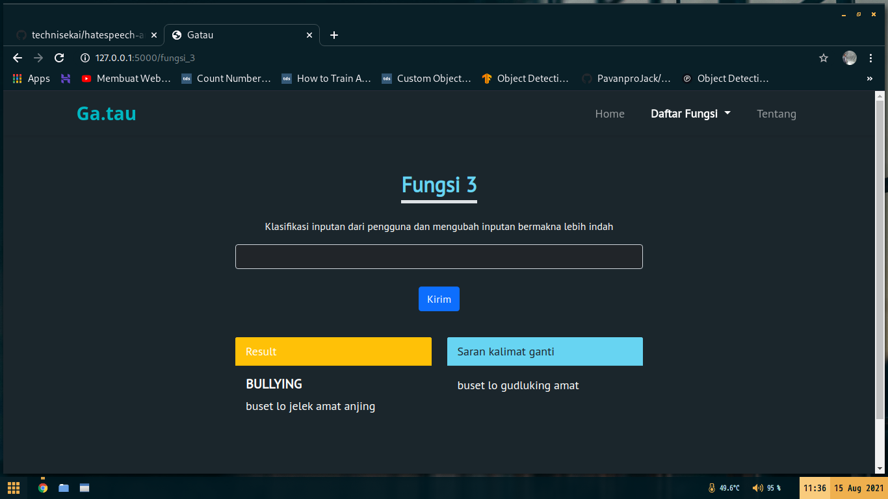

<p align="center">
  
</p>


### :notebook_with_decorative_cover: Description
This project is use machine learning for detec hatespeech or cyberbullying and implement it to flask. Use indonesian twitter hatespeech comment and indonesian instagram cyberbullying comment dataset and provide above 80% accuracy in train or test with CNN model and custom layer also parameter.

### :eyes: Overview
 &nbsp;  
 &nbsp;  

### :tanabata_tree: How to use
1. Install library 
```
pip install -r requirements.txt
```
2. Run app.py
```
python appp.py
```
